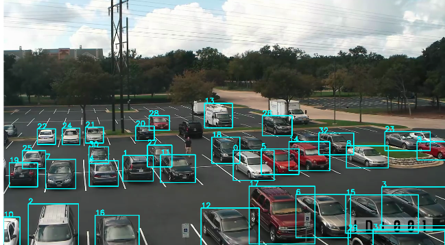
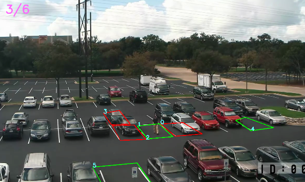
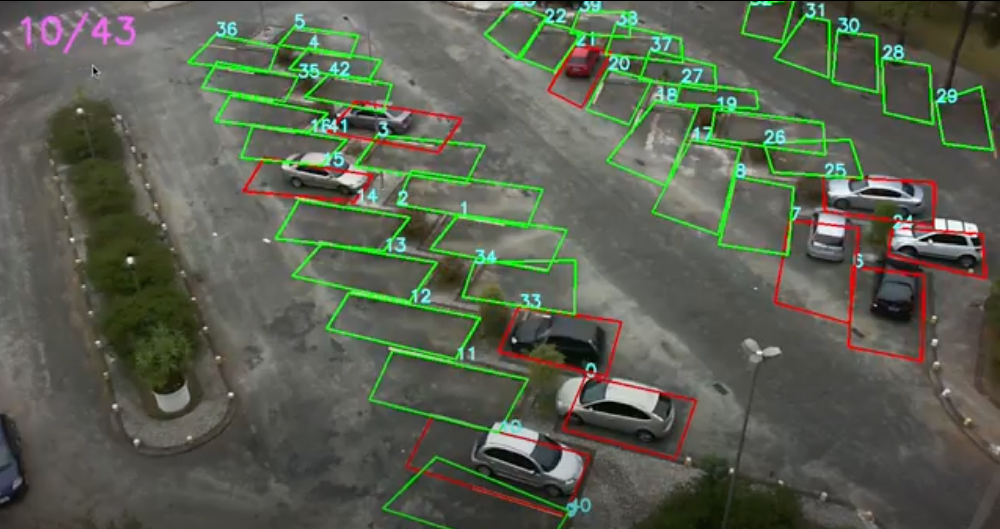

# Parking Spot Labeling and Classification Tool

Using computer vision algorithms and image processing tools to identify and classify between empty or occupied parking spots in a parking lot

This was developed for my digital image processing class final project, the grade was a **10**/10

I developed with Python and OpenCv a tool so the user can label the spots in the parking lot, and then, a neural network (YOLOv8) will run and classify the spots into empty or occupied.
You can see the full slides for the presentation [here](https://docs.google.com/presentation/d/1ROqLlSL0i8CinPbhkshoKKfHofDw-QMf1JXPLwzKbTI/edit?usp=sharing) (it's in Portuguese, but if you're interested in knowing more, you can contact me at leomconti@gmail.com)

## Screenshots:

Below is the screenshot for the automatic labeling using neural networks

Here's the manual labelling with the classifier running

And in another parking lot:

